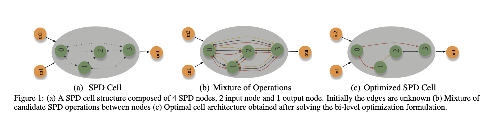
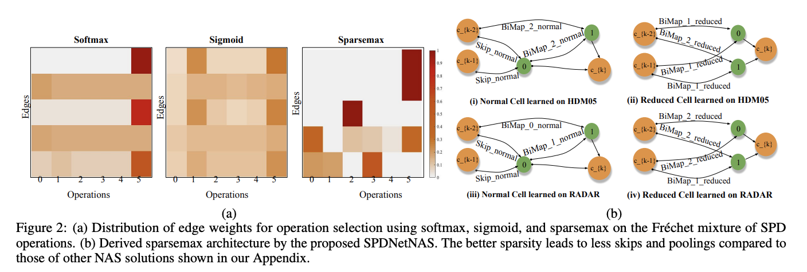
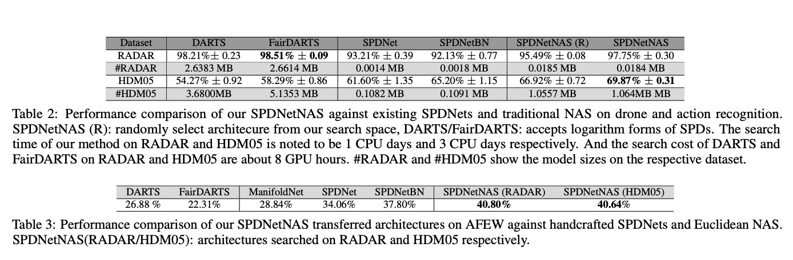
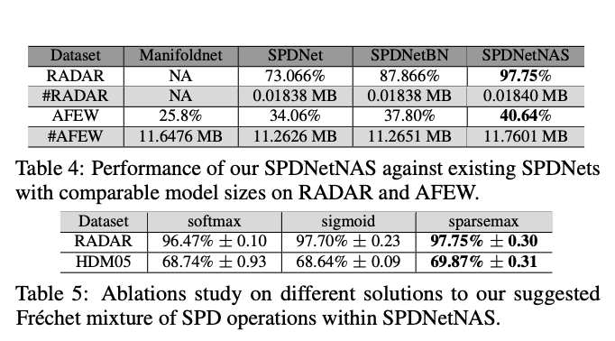
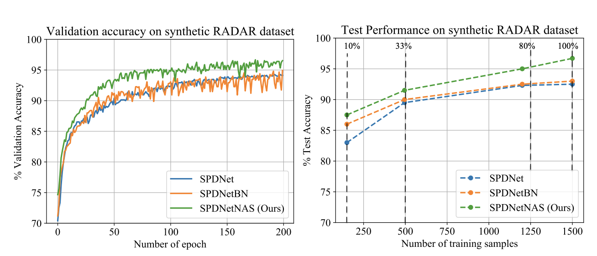

# Neural Architecture Search of SPD Manifold Networks
### Accepted to IJCAI 2021
#### Authors: [Rhea Sukthanker](https://rheasukthanker.github.io/), [Zhiwu Huang](https://zhiwu-huang.github.io/), [Suryansh Kumar](https://suryanshkumar.github.io/), [Erik Goron Endsjo](https://ch.linkedin.com/in/erikgoron), [Yan Wu](https://vision.ee.ethz.ch/people-details.MjUzMDc2.TGlzdC8zMjg5LC0xOTcxNDY1MTc4.html) and [Luc Van Gool](https://scholar.google.ch/citations?hl=en&user=TwMib_QAAAAJ)

Paper: https://www.ijcai.org/proceedings/2021/0413.pdf



## Abstract
In this paper, we propose a new neural architecture search (NAS) problem of Symmetric Positive Definite (SPD) manifold networks, aiming to automate
the design of SPD neural architectures. To address this problem, we first introduce a geometrically rich and diverse SPD neural architecture search space
for an efficient SPD cell design. Further, we model our new NAS problem with a one-shot training process of a single supernet. Based on the supernet modeling, we exploit a differentiable NAS algorithm on our relaxed continuous search space for SPD neural architecture search. Statistical evaluation of our method on drone, action, and emotion recognition tasks mostly provides better results than the state-of-the-art SPD networks and traditional NAS algorithms. Empirical results show that our algorithm excels in discovering better performing SPD network design and provides models that are more than three times lighter than searched by the state-of-the-art NAS algorithms.

## Overview
1. [Installation & Dependencies](#Dependencies)
2. [Prepration](#Prepration)
    1. [Directories](#Directories)
    2. [Data](#Data)
3. [Training](#Training)
    1. [Searching + Training and Evaluation](#launch)
4. [Results](#Results)
5. [Contact](#Contact)
6. [How to Cite](#How-to-Cite)

## 1. Installation & Dependencies<a name="Dependencies"></a>
The code has been tested with Python 3.6 and Pytorch 1.0.1.


To install the dependencies:
```bash
conda create --name py37 python=3.7
pip install -r requirements.txt
```

## 2. Preparation<a name="Prepration"></a>

### 2.1. Directories<a name="Directories"></a>
Our code is based upon a <b> DARTS </b> style implementation. The code for darts i available here <a href=https://github.com/quark0/darts> darts</a>
The root directory contains the models and the training files. 

The root folder contains a folder called <b> data </b> where all the datasets are saved. The datasets can be downloaded from the links below. 

The <b>Code</b> folder contains the <a href="https://github.com/Open-Debin/Emotion-FAN">Emotion-FAN</a> model's code which is the pretrained model used in our experiments for emotion-recognition (AFEW). Download the pretrained <a href="https://github.com/Open-Debin/Emotion-FAN">Emotion-FAN</a> model from its repository and place it in the root directory.  

### 2.2. Data<a name="Data"></a>
Data preparation is done based on the setup you are using. The code is adapted to three setups:
<ol>
    <li><b>Radar(Drone Recognition)</b>: 3000 SPD datapoints distributed among 3 classes (size 20 × 20)</li>
    <li><b>HDMO5(Action Recognition)</b>: 2083 SPD datapoints distributed among 117 classes (size 93×93)</li>
    <li><b>AFEW(Emotion Recognition)</b>: 1345 SPD datapoints distibuted among 7 classes (Image size 100x100)</li>
</ol>    

We use the Radar and HDM05 datasets directly from the <a href="https://proceedings.neurips.cc/paper/2019/file/6e69ebbfad976d4637bb4b39de261bf7-Supplemental.zip">SPDNetBN</a>. While for the AFEW2014 we use the raw images below. Below you can find and download the datasets used in our experiments:
<ul>
    <li><a href="https://drive.google.com/file/d/1Wk4Ie8S164t7n5PFzAnlVYPwjjCDG-p1/view?usp=sharing">RADAR</a>: This dataset’s synthetic setting is composed of radar signals distributed into 3 classes, where each signal is split into windows of length 20, resulting in a 20x20 covariance matrix for each window. </li>
    <li><a href="https://drive.google.com/file/d/1WtbpuKuB3vwp4vtfTWvJi05hBkfSvNSu/view?usp=sharing">HDM05</a>: The dataset has 2083 SPD matrices distributed amongst  117 action classes</li>
    <li><b>AFEW</b>:This dataset has 1345 videos
of facial expressions classified into 7 distinct classes i.e. angry, fear, disgust, surprise, neutral, happy and sad. You can get the AFEW dataset by ask the official organizer: shreya.ghosh@iitrpr.ac.in and emotiw2014@gmail.com. Unzip the dataset and place it in the <b>data/<b> folder </li>
</ul>

Note the <b>data/</b> folder contains all the datsets and is placed in the root folder.


## 3. Training<a name="Training"></a>
### 3.1. Launch the Training<a name="launch"></a>
To launch the search followed by training and evaluation for the Radar datset:

```python
python -u train_spd_search_radar_sparsemax.py --unrolled --epochs 100  "$@"
python -u train_spd_radar.py --arch radar_sparsemax "$@"
```

To launch the search followed by training and evaluation for the HDM05 datset:
```python
python -u train_spd_search_hdm05_sparsemax.py --unrolled --epochs 300 "$@"
python -u train_spd_hdm05.py --arch hdm05_sparsemax "$@"
```
For the afew dataset we directly transfer the searched architectures from Radar and HDMO5 datasets. Launch the training and evaluation using the command below:
```python
python -u train_spd_afew.py --arch radar_sparsemax "$@"
python -u train_spd_afew.py --arch hdm05_sparsemax "$@"
```

## 4. Results<a name="Results"></a>
### Edge weight distribution and derived sparsemax architectures:



### Performance comparison of our SPDNetNAS against existing SPDNets and traditional NAS on drone, action and emotion recognition


### Ablation studies:




### Convergence Analysis:


## 5. Contact<a name="Contact"></a>
For any questions, suggestions, or issues with the code, please contact <a>rheasukthanker@gmail.com</a>.


## 7. How to Cite<a name="How-to-Cite"></a>
If you find this project helpful, please consider citing us as follows:
```bash
@inproceedings{ijcai2021-413,
  title     = {Neural Architecture Search of SPD Manifold Networks},
  author    = {Sukthanker, Rhea Sanjay and Huang, Zhiwu and Kumar, Suryansh and Goron Endsjo, Erik and Wu, Yan and Van Gool, Luc},
  booktitle = {Proceedings of the Thirtieth International Joint Conference on
               Artificial Intelligence, {IJCAI-21}},
  publisher = {International Joint Conferences on Artificial Intelligence Organization},
  editor    = {Zhi-Hua Zhou},
  pages     = {3002--3009},
  year      = {2021},
  month     = {8},
  note      = {Main Track}
  doi       = {10.24963/ijcai.2021/413},
  url       = {https://doi.org/10.24963/ijcai.2021/413},
}
```
